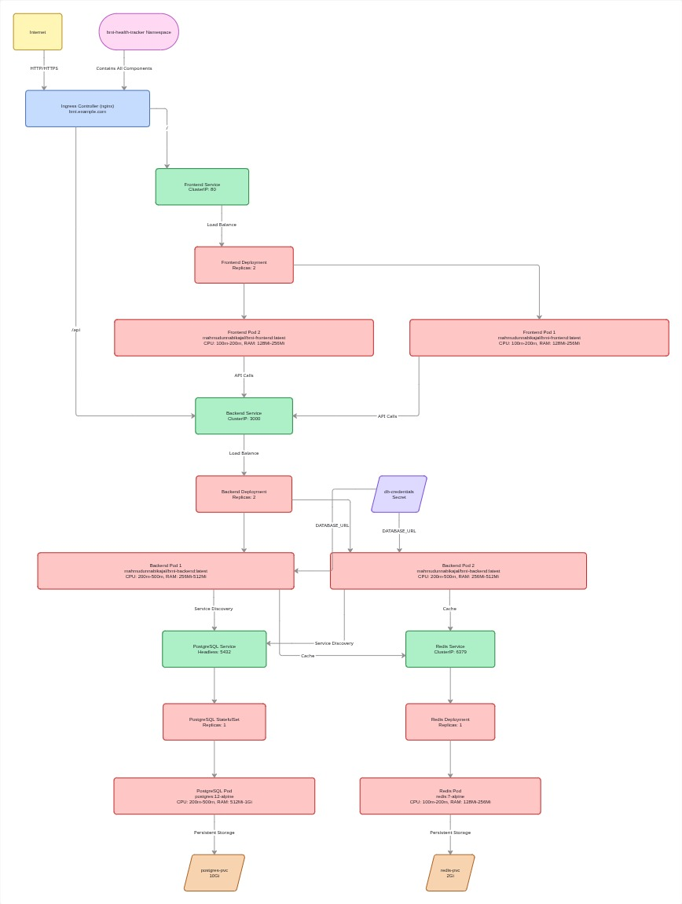

# Kubernetes Architecture for BMI Health Tracker

## Overview

Production-ready Kubernetes deployment for the BMI Health Tracker application with automatic scaling, health checks, and persistent storage.

## Archetecture Diagram

## Kubernetes Objects

### Namespace

- `bmi-health-tracker` - Isolates all resources

### Secrets

- `db-credentials` - Base64 encoded database credentials
  - username: `bmi_user`
  - password: `strongpassword`
  - database: `bmidb`
  - db-url: Full PostgreSQL connection string

### Frontend Deployment

- **Replicas:** 2
- **Image:** `mahmudunnabikajal/bmi-frontend:latest`
- **Port:** 80 (Nginx)
- **Resource Requests:**
  - CPU: 100m | Memory: 128Mi
- **Resource Limits:**
  - CPU: 200m | Memory: 256Mi
- **Health Checks:**
  - Liveness: HTTP GET `/` every 10s
  - Readiness: HTTP GET `/` every 5s
- **Service:** ClusterIP (internal only)

### Backend Deployment

- **Replicas:** 2
- **Image:** `mahmudunnabikajal/bmi-backend:latest`
- **Port:** 3000 (Express API)
- **Environment:**
  - `NODE_ENV=production`
  - `DATABASE_URL` from Secret
- **Resource Requests:**
  - CPU: 200m | Memory: 256Mi
- **Resource Limits:**
  - CPU: 500m | Memory: 512Mi
- **Health Checks:**
  - Liveness: HTTP GET `/health` every 10s
  - Readiness: HTTP GET `/health` every 5s
- **Service:** ClusterIP (internal only)

### PostgreSQL StatefulSet

- **Replicas:** 1
- **Image:** `postgres:12-alpine`
- **Port:** 5432
- **Persistent Volume:**
  - Size: 10Gi
  - Mount Path: `/var/lib/postgresql/data`
- **Resource Requests:**
  - CPU: 200m | Memory: 512Mi
- **Resource Limits:**
  - CPU: 500m | Memory: 1Gi
- **Service:** Headless (clusterIP: None) for StatefulSet DNS

### Redis Deployment

- **Replicas:** 1
- **Image:** `redis:7-alpine`
- **Port:** 6379
- **Persistent Volume:**
  - Size: 2Gi
  - Mount Path: `/data`
- **Resource Requests:**
  - CPU: 100m | Memory: 128Mi
- **Resource Limits:**
  - CPU: 200m | Memory: 256Mi
- **Health Checks:**
  - Liveness: TCP socket check on 6379
  - Readiness: `redis-cli ping` command
- **Service:** ClusterIP (internal only)

### Ingress

- **Host:** `bmi.example.com` (update with your domain)
- **Routes:**
  - `/` → frontend-service:80
  - `/api` → backend-service:3000

## Deployment Instructions

### 1. Create namespace and secrets

Apply namespace and secrets:

- `kubernetes/namespace.yaml`
- `kubernetes/secrets/`

### 2. Deploy PostgreSQL

Apply: `kubernetes/postgresql.yaml`

Wait for PostgreSQL pod to be ready.

### 3. Deploy Redis

Apply: `kubernetes/redis.yaml`

Wait for Redis pod to be ready.

### 4. Deploy backend

Apply: `kubernetes/backend.yaml`

Wait for backend deployment to be ready.

### 5. Deploy frontend

Apply: `kubernetes/frontend.yaml`

Wait for frontend deployment to be ready.

### 6. Deploy ingress

Apply: `kubernetes/ingress.yaml`

### 7. Verify deployment

Verify resources:

- All pods in Running state
- All services created
- Ingress has IP assigned
- Check logs for errors

## Access Application

1. Update your hosts file or DNS:
   - Map cluster IP to `bmi.example.com`
   - Or configure DNS provider

2. Access the app:
   - Frontend: http://bmi.example.com
   - Backend API: http://bmi.example.com/api

## Scaling

Scale deployments by updating replica counts in YAML files:

- `kubernetes/frontend.yaml` - Frontend replicas
- `kubernetes/backend.yaml` - Backend replicas

Kubernetes automatically creates or removes pods to match desired replicas.

## Monitoring & Debugging

### Pod Status

Watch pod status in the namespace.

Check if Running, Pending, or CrashLoopBackOff.

### Pod Events

Describe pods to see recent events and conditions.

Shows why pods failed or scheduling issues.

### Container Logs

View logs from containers to diagnose issues.

Check stdout and stderr for errors.

Files: `kubernetes/backend.yaml`, `kubernetes/frontend.yaml`, `kubernetes/postgresql.yaml`, `kubernetes/redis.yaml`

### Port Forward for Local Access

Forward local ports to services:

- Frontend: port 8080 → port 80
- Backend: port 3000 → port 3000
- PostgreSQL: port 5432 → port 5432
- Redis: port 6379 → port 6379

## Storage & Backup

### View PVC

List all PersistentVolumeClaims in namespace.

Check storage size and volume status.

See `kubernetes/postgresql.yaml` and `kubernetes/redis.yaml` for definitions.

### Backup PostgreSQL

Create database backups:

1. Access PostgreSQL pod
2. Use pg_dump to export database
3. Save backup file locally

See `kubernetes/postgresql.yaml` for connection details.

Credentials in `kubernetes/secrets/db-credentials.yaml`.

### Restore PostgreSQL

Restore from backup file:

1. Access PostgreSQL pod
2. Use psql to import backup
3. Verify data restored

Test backups before relying on them for recovery.
